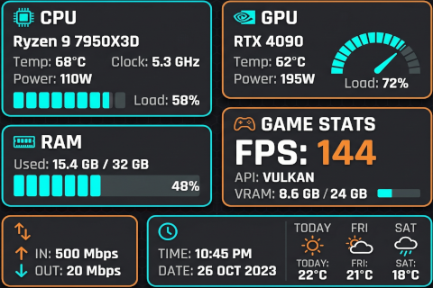

# TuringMonitor (Turing Smart Screen Linux)

[](https://opensource.org/licenses/MIT)
[](README.pt-BR.md)

A high-performance, ultra-lightweight system monitor for Linux, built with **.NET 10** and **Native AOT**, specifically designed for 3.5" USB LCD displays (Turing Smart Screen / Revision A).



## 🚀 Key Features

- **Native AOT:** High-performance native binary with ultra-low memory footprint (< 20MB).
- **Theme Engine:** Fully customizable JSON-based layout system with real transparency support.
- **Live Reload:** Calibrate your layout in real-time—save the JSON and see changes on the LCD instantly.
- **Delta Updates:** Intelligent rendering that sends only modified pixels to the hardware for high responsiveness.
- **Full Telemetry:** Real-time data for CPU, GPU (NVIDIA), RAM, Network, and Weather.

---

## 🛠️ Quick Installation

### 1. Prerequisites
- **.NET 10 SDK** (required for building).
- Dependencies: `libicu`, `libssl`, `libusb`.
- A 3.5" Turing Smart Screen (Revision A).

### 2. Install using Script
We provide a simple installation script that builds the project and sets up a systemd daemon:

```bash
chmod +x install.sh
./install.sh
```

The script will:
1. Build the binary using **Native AOT**.
2. Install the application to `/usr/local/bin/TuringMonitor`.
3. Configure and start a `systemd` service (`turing-monitor.service`).
4. Add your user to the `dialout` group for serial port access.

---

## 🎨 Theme Guide

### Selection
To change the active theme, edit `appsettings.json`:
```json
{
  "Theme": "MyCustomTheme"
}
```
Themes are located in `Assets/Themes/`.

### Creating a Custom Theme
1. Create a new folder in `Assets/Themes/[ThemeName]`.
2. Add a `background.png` (480x320).
3. Create a `theme.json` file.
4. (Optional) Add an `Icons/` folder with weather icons (01d.png, etc).

### Global Configuration (`theme.json`)

| Field | Description |
| :--- | :--- |
| `Background` | Background image file name. |
| `FontPath` | Path to a `.ttf` font file (relative to root). |
| `DebugMode` | If `true`, draws red bounding boxes around elements. |
| `Latitude` / `Longitude` | Geographical coordinates for weather. |

### Element Types
- `Text`: Renders formatted strings.
- `ProgressBar`: Segmented horizontal bar.
- `Gauge`: 180° segmented arc.
- `Icon`: Dynamic PNG icons based on weather.

---

## 📊 Data Sources

- `CpuName`, `CpuLoad`, `CpuTemp`, `CpuClock`, `CpuPower`
- `GpuModel`, `GpuLoad`, `GpuTemp`, `GpuPower`, `VramString`, `VramPercent`
- `RamString`, `RamPercent`
- `NetInMbps`, `NetOutMbps`, `NetInString`, `NetOutString`
- `WeatherTemp`, `WeatherIcon`
- `DateTime`

---

## ⚖️ License

This project is licensed under the **MIT License**. Created by **bendak**.
